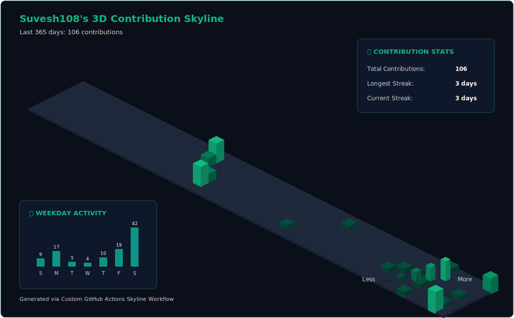
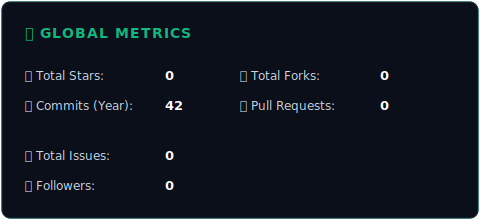
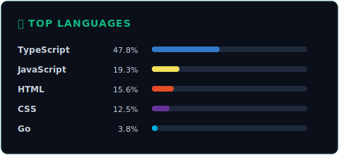
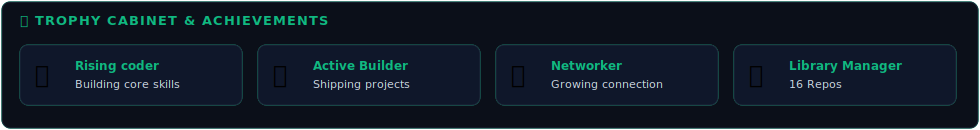

  

<!-- Typing intro -->

  

<!-- Social badges -->

  
  
  
  
  
    
  

 

<!-- Featured 3D Isometric contribution graph -->

  <h2>📊 3D Isometric Contribution Skyline</h2>
  

 

<!-- About me and quick config side-by-side -->
<table>
  <tr>
    <td width="50%" valign="top">
      <h3>🚀 About Me</h3>
      

        I am a passionate <b>Full Stack Developer</b> and <b>Cloud Enthusiast</b> based in India 🇮🇳. With a BTech in Computer Science, I specialize in building high-performance web applications, cloud-native deployments, and server-side automation.
      

      

        ⚡ <i>"Ship fast. Learn faster."</i>
      

      

        <b>Currently Learning:</b> Kubernetes, Rust, System Design.  
        <b>Fun Fact:</b> I automate everything I do more than twice!
      

    </td>
    <td width="50%" valign="top">
      <h3>🛠️ Info & System Config</h3>
      <ul>
        <li><b>Role:</b> Full Stack Developer</li>
        <li><b>Stack Focus:</b> Cloud, System Design, Web Dev</li>
        <li><b>Core languages:</b> TypeScript, Python, Go, Rust</li>
        <li><b>Philosophy:</b> Native features before dependencies</li>
      </ul>
    </td>
  </tr>
</table>

 

<!-- Tech Stack Grid -->
<h3>🎨 Tech Arsenal</h3>

  <table>
    <tr>
      <td align="center"><b>Frontend</b></td>
      <td></td>
    </tr>
    <tr>
      <td align="center"><b>Backend</b></td>
      <td></td>
    </tr>
    <tr>
      <td align="center"><b>DevOps & Cloud</b></td>
      <td></td>
    </tr>
  </table>

 

<!-- Featured Projects -->
<h3>📂 Featured Projects</h3>

  <table>
    <tr>
      <td width="50%" valign="top">
        <h4>🎬 <a href="https://github.com/Suvesh108/FilmFlux-AI">FilmFlux-AI</a></h4>
        
An AI-powered cinema platform for discovering, filtering, and generating personalized movie recommendations.

        <code>Next.js</code> <code>TypeScript</code> <code>Tailwind</code> <code>Gemini AI</code>
      </td>
      <td width="50%" valign="top">
        <h4>🔍 <a href="https://github.com/Suvesh108/Lumina-Search">Lumina-Search</a></h4>
        
A fast, semantic search engine built for indexing and querying technical documentation with instant response times.

        <code>Go</code> <code>Rust</code> <code>REST API</code> <code>Markdown</code>
      </td>
    </tr>
    <tr>
      <td width="50%" valign="top">
        <h4>🧠 <a href="https://github.com/Suvesh108/ai-quiz-generator">AI-Quiz-Generator</a></h4>
        
Interactive web application that automatically generates comprehensive educational quizzes from any text prompt.

        <code>Python</code> <code>React</code> <code>GraphQL</code> <code>OpenAI</code>
      </td>
      <td width="50%" valign="top">
        <h4>🛡️ <a href="https://github.com/Suvesh108/NetPulse">NetPulse</a></h4>
        
A lightweight, native system utility for monitoring active network performance and server ping latency stats.

        <code>Rust</code> <code>System API</code> <code>Go</code> <code>CLI</code>
      </td>
    </tr>
  </table>

 

<!-- GitHub Metrics & Activity -->
<h3>📈 GitHub Analytics</h3>

  <table>
    <tr>
      <td width="50%" align="center">
        
      </td>
      <td width="50%" align="center">
        
      </td>
    </tr>
    <tr>
      <td colspan="2" align="center">
        
      </td>
    </tr>
  </table>

 

<!-- Trophy Case -->
<h3>🏆 Trophy Cabinet</h3>

  

 

<!-- Side by side dynamic blocks (Blog and Recent Activity) -->
<table>
  <tr>
    <td width="50%" valign="top">
      <h3>📰 Latest Blog Posts</h3>
      <!-- BLOG-POST-LIST:START -->
      <!-- BLOG-POST-LIST:END -->
       
      
<i>⚡ Auto-updated</i>

    </td>
    <td width="50%" valign="top">
      <h3>⚡ Recent Activity</h3>
      <!--START_SECTION:activity-->
      <!--END_SECTION:activity-->
       
      
<i>🔄 Auto-updated</i>

    </td>
  </tr>
</table>

 

<!-- Footer quote and badges -->

  
    
  <h3>⭐ Thanks for stopping by!</h3>
  
  
    
  

