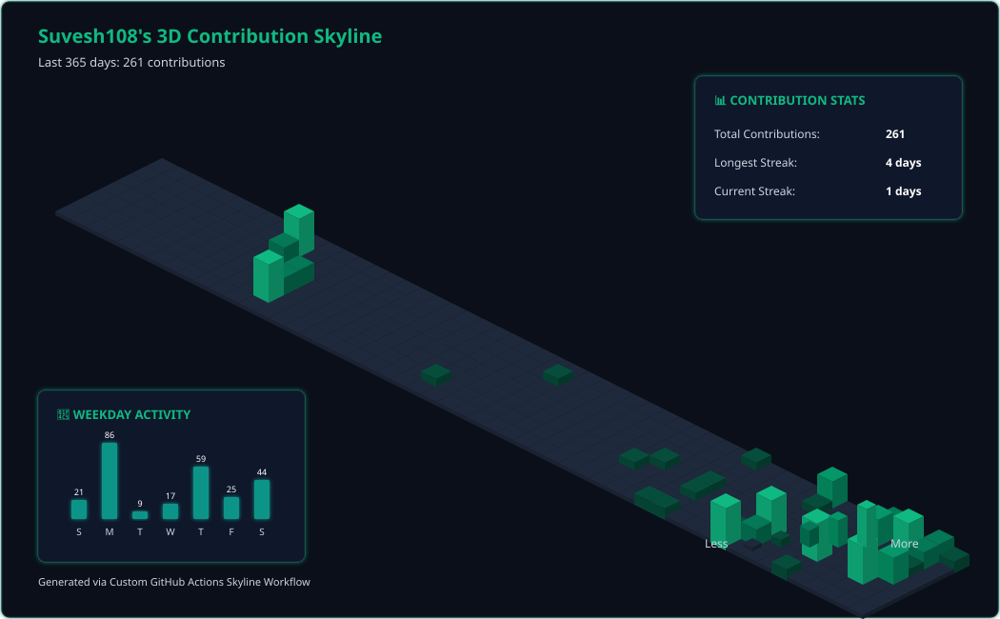

  <h1>Suvesh Kumar</h1>
  
<b>Senior Full Stack Engineer &amp; Distributed Systems Architect</b>

  

    
    
    
  

  

    
    
    
    
  

  
<i>Architecting resilient cloud-native infrastructure, low-latency backends, and intelligent distributed automation.</i>

---

### 📊 3D Isometric Contribution Skyline

  

---

### ⚡ Engineering Focus & Invariants

* **Core Philosophy:** Platform primitives, clean architecture, and low-latency throughput over heavy framework bloat.
* **Active Pursuits:** Distributed consensus systems, concurrent streams in Go & Rust, and custom Kubernetes controllers.
* **Production Invariant:** Zero-trust defensive schemas, parameterized queries, and strict end-to-end type safety.

---

### 🛠️ Core Tech Arsenal

  

    
    
  

  

    
    
  

---

### 📂 Featured Implementations

#### 🎬 [FilmFlux-AI](https://github.com/Suvesh108/FilmFlux-AI)
> AI-powered cinema intelligence platform with semantic movie filtering, contextual vector recommendations, and responsive UI.
>
> `Next.js` · `TypeScript` · `TailwindCSS` · `Gemini AI` · `REST API`

#### 🔍 [Lumina-Search](https://github.com/Suvesh108/Lumina-Search)
> Sub-millisecond semantic search engine engineered for indexing technical documentation with in-memory caching and inverted indexes.
>
> `Go` · `Rust` · `In-Memory Index` · `RESTful Service`

#### 🧠 [AI-Quiz-Generator](https://github.com/Suvesh108/ai-quiz-generator)
> Dynamic evaluation platform converting heterogeneous inputs (text, PDFs, URLs) into structured, graded assessment suites.
>
> `Python` · `React` · `FastAPI` · `GraphQL` · `OpenAI API`

#### 🛡️ [NetPulse](https://github.com/Suvesh108/NetPulse)
> Lightweight system daemon monitoring real-time network telemetry, server ping jitter, and packet loss metrics across interfaces.
>
> `Rust` · `Go` · `System Telemetry` · `CLI` · `Prometheus`

---

### 📈 GitHub Analytics & Velocity

  
  

  

  

---

### 📰 Engineering Activity & Logs

#### Technical Writing
<!-- BLOG-POST-LIST:START -->
<!-- BLOG-POST-LIST:END -->

#### Recent Activity
<!--START_SECTION:activity-->
<!--END_SECTION:activity-->

---

  
    
  
  

