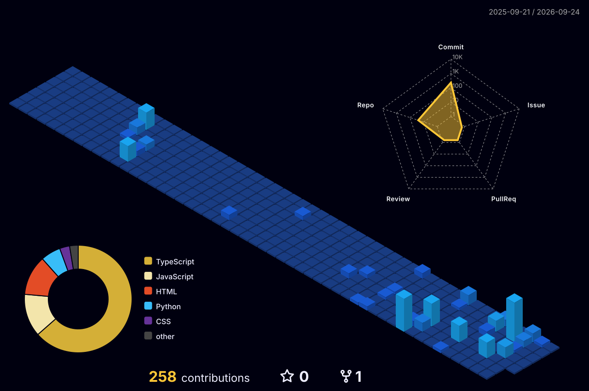
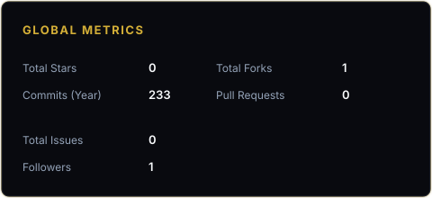
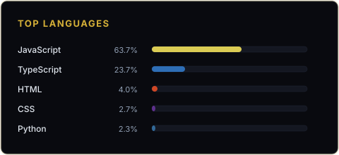
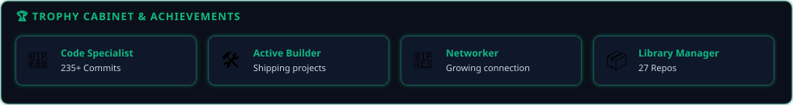

  <h1>Suvesh Kumar</h1>
  
<b>Senior Full Stack Engineer &amp; Distributed Systems Architect</b>

  

    
    
    
  

  

    
    
    
    
  

  
<i>Architecting resilient cloud-native infrastructure, low-latency backends, and intelligent distributed automation.</i>

---

### 📊 3D Isometric Contribution Skyline

  

---

### ⚡ Engineering Focus & Invariants

* **Core Philosophy:** Platform primitives, clean architecture, and low-latency throughput over heavy framework bloat.
* **Active Pursuits:** Distributed consensus systems, concurrent streams in Go & Rust, and custom Kubernetes controllers.
* **Production Invariant:** Zero-trust defensive schemas, parameterized queries, and strict end-to-end type safety.

---

### 🛠️ Core Tech Arsenal

  

    
    
  

  

    
    
  

---

### 📂 Featured Implementations

#### ⚡ [jobscrap](https://github.com/Suvesh108/jobscrap)
> High-performance multi-threaded job scraper & aggregator with TLS fingerprint bypassing, automated deduplication, and parsing across Naukri, LinkedIn, Indeed, Glassdoor, and Internshala.
>
> `Python` · `AsyncIO` · `TLS Bypass` · `Data Aggregation` · `REST API`

#### 🌐 [NetPulse](https://github.com/Suvesh108/NetPulse)
> Premium real-time edge network diagnostic and telemetry platform powered by Cloudflare Speedtest engine with zero-CORS latency tracking and jitter analytics.
>
> `React` · `TypeScript` · `Cloudflare Edge` · `Telemetry` · `TailwindCSS`

#### 📥 [vortex](https://github.com/Suvesh108/vortex)
> High-bitrate multi-threaded media extraction utility featuring parallel stream downloading, lossless audio-video muxing, and custom format pipelines.
>
> `TypeScript` · `Node.js` · `Streaming Architecture` · `FFmpeg` · `CLI`

#### 🔗 [BlockVerify](https://github.com/Suvesh108/BlockVerify)
> Decentralized product authentication and supply chain tracking protocol using cryptographic IDs, instant NFC/QR verification, and transparent provenance records.
>
> `JavaScript` · `Blockchain` · `Supply Chain Security` · `NFC / QR` · `Smart Contracts`

---

### 📈 GitHub Analytics & Velocity

  
  

  

  

---

### 📰 Engineering Activity & Logs

#### Technical Writing
<!-- BLOG-POST-LIST:START -->
<!-- BLOG-POST-LIST:END -->

#### Recent Activity
<!--START_SECTION:activity-->
1. 🚀 Published release [VortexDownloader v0.6.7](https://github.com/Suvesh108/vortex/releases/tag/v0.6.7) in [Suvesh108/vortex](https://github.com/Suvesh108/vortex)
2. 🚀 Published release [VortexDownloader v0.6.6](https://github.com/Suvesh108/vortex/releases/tag/v0.6.6) in [Suvesh108/vortex](https://github.com/Suvesh108/vortex)
3. 🚀 Published release [NetPulse v1.0 - Official Production Release (Android & Windows Desktop)](https://github.com/Suvesh108/NetPulse/releases/tag/v1.0) in [Suvesh108/NetPulse](https://github.com/Suvesh108/NetPulse)
4. 🚀 Published release [VortexDownloader v0.6.5](https://github.com/Suvesh108/vortex/releases/tag/v0.6.5) in [Suvesh108/vortex](https://github.com/Suvesh108/vortex)
5. 🚀 Published release [VortexDownloader v0.6.4](https://github.com/Suvesh108/vortex/releases/tag/v0.6.4) in [Suvesh108/vortex](https://github.com/Suvesh108/vortex)
6. 🚀 Published release [VortexDownloader v0.6.3](https://github.com/Suvesh108/vortex/releases/tag/v0.6.3) in [Suvesh108/vortex](https://github.com/Suvesh108/vortex)
7. 🚀 Published release [VortexDownloader v0.6.2](https://github.com/Suvesh108/vortex/releases/tag/v0.6.2) in [Suvesh108/vortex](https://github.com/Suvesh108/vortex)
8. 🚀 Published release [VortexDownloader v0.6.1](https://github.com/Suvesh108/vortex/releases/tag/v0.6.1) in [Suvesh108/vortex](https://github.com/Suvesh108/vortex)
9. 🚀 Published release [VortexDownloader v0.5.9](https://github.com/Suvesh108/vortex/releases/tag/v0.5.9) in [Suvesh108/vortex](https://github.com/Suvesh108/vortex)
10. 🚀 Published release [VortexDownloader v0.5.8](https://github.com/Suvesh108/vortex/releases/tag/v0.5.8) in [Suvesh108/vortex](https://github.com/Suvesh108/vortex)
<!--END_SECTION:activity-->

---

  
    
  
  

